## SOV Admin 1.2.2 — sync foundation

Ovaj build dodaje stabilniji role/sync sloj za APK:

- lokalni cache permissiona s vremenom zadnjeg synca
- jasni online / cached offline / offline fallback status
- refresh token pokušaj kod ručnog synca ili isteka sessiona
- sigurniji fallback: ako Supabase nije dostupan, koristi se spremljeni cache
- bez promjene SQL sheme i bez diranja web builda

## SOV Admin APK 1.2.1 — unified-role-gated

- versionName: `1.2.2-sync-foundation`
- versionCode: `900008`
- Nastavak na 1.2.0 unified role preview.
- Supabase login/permission sync ostaje u Home/Tools dijelu.
- Glavni APK moduli sada se gateaju prema lokalno spremljenim permissionima:
  - Search/Map: `can_view_sov_base` ili `can_view_katastar`
  - Izleti: `can_manage_trips`
  - Slojevi/Offline: SOV view ili trip management
  - Tools/kalkulator/runner ostaju dostupni
- Ako korisnik nije approved, app ga vraća na Home/Settings i pokazuje kratku poruku.
- Offline admin default ostaje full-access fallback za terenski/admin build dok nema login sessiona.

# SOV App v1.1 — README / terenski manual

**SOV App** je Android terenski alat za speleološke objekte, karte, offline rad, trackove, izlete, osobne baze i timsko dijeljenje podataka.

Ovaj README je zamjena za stari tehnički changelog README. Changelog i build povijest ostaju u `docs/CHANGELOG.md` i `docs/BUILD_HISTORY.md`, a ovdje je praktični manual za korisnike.

## Build info

- **Verzija:** SOV `1.1 PUBLIC RELEASE`
- **versionName:** `1.1.1`
- **versionCode:** `465`
- **Očekivani APK nakon lokalnog potpisa:** `SOV1.1.1.apk`
- **Default jezik:** hrvatski
- **Jezik se pamti:** ako korisnik prebaci na ENG, izbor ostaje spremljen

## Brzi start

1. Instaliraj aplikaciju i dopusti lokaciju.
2. Na karti uključi GPS i provjeri preciznost.
3. U **Pretrazi** odaberi bazu: SOV, Moja baza ili Sve.
4. Rezultate prikaži na karti ili ih izvezi kao KML.
5. Prije terena u **Izleti** pripremi lokaciju, offline kartu i opcionalne trackove.
6. U **Slojevi / Maps & Layers** dodaj offline karte, hillshade, WMS ili importane datoteke.

---

## 1. Legenda točaka na karti

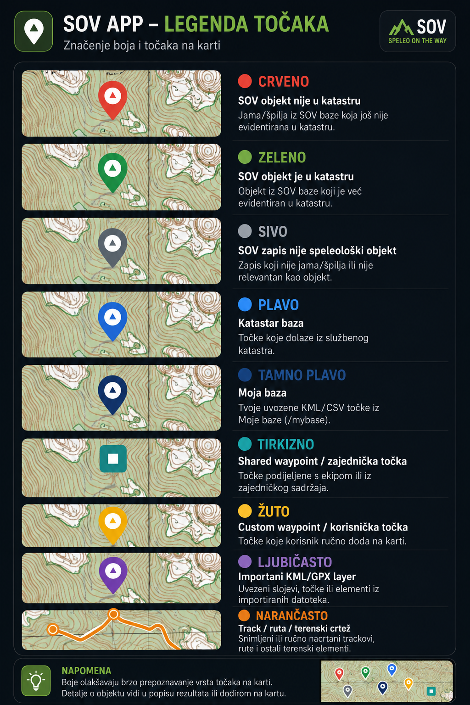

Boje na karti služe da odmah znaš iz kojeg izvora dolazi točka i kakav je njen status.

| Boja / oblik | Značenje |
|---|---|
| **Crveno** | SOV objekt za provjeru / unos / dodatnu obradu. |
| **Zeleno** | SOV objekt s potvrđenim statusom u bazi. |
| **Sivo** | SOV zapis nije speleološki objekt ili nije relevantan kao objekt. |
| **Tamno plavo** | Moja baza. Tvoje uvezene KML/CSV točke iz `/mybase`. |
| **Tirkizno / teal, četvrtasti marker** | Shared waypoint / zajednička točka. Točka podijeljena s ekipom ili iz zajedničkog sadržaja. |
| **Žuto** | Custom waypoint / korisnička točka dodana ručno na karti. |
| **Ljubičasto** | Importani KML/GPX sloj ili vanjski import. |
| **Narančasto** | Track, ruta ili ručni terenski crtež. |

---

## 2. Karta i glavno sučelje

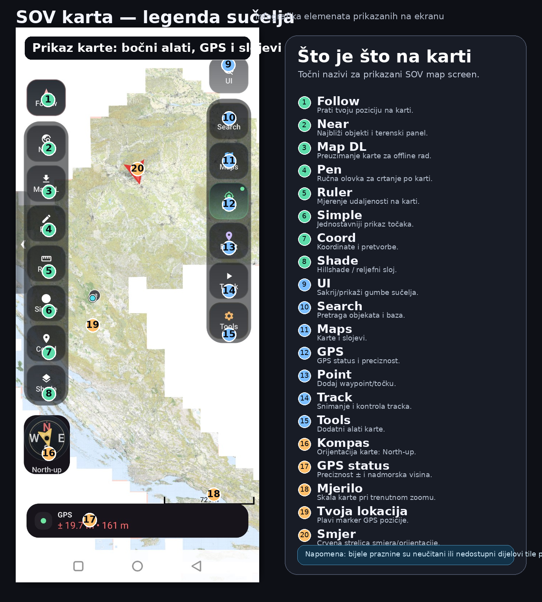

Glavna karta služi za rad na terenu: GPS, pretraga, slojevi, trackovi, waypointi, mjerenje i ručno crtanje.

Najvažnije akcije:

- **Follow** — prati tvoju poziciju na karti.
- **Near** — prikazuje najbliže objekte oko tebe.
- **Map DL** — priprema offline kartu za područje.
- **Pen** — ručno crtanje po karti; nacrtanu liniju možeš spremiti i izvesti kao GPX.
- **Ruler** — mjerenje udaljenosti.
- **Simple** — jednostavniji prikaz karte.
- **Coord** — koordinatni alati i pretvorbe.
- **Shade** — hillshade / reljefni prikaz.
- **Search** — pretraga baza.
- **Maps** — karte, slojevi, offline paketi, WMS i importi.
- **GPS** — preciznost, visina i stanje lokacije.
- **Point** — dodavanje nove točke.
- **Track** — snimanje rute kretanja.
- **Tools** — dodatni alati.

---

## 3. Pretraga objekata

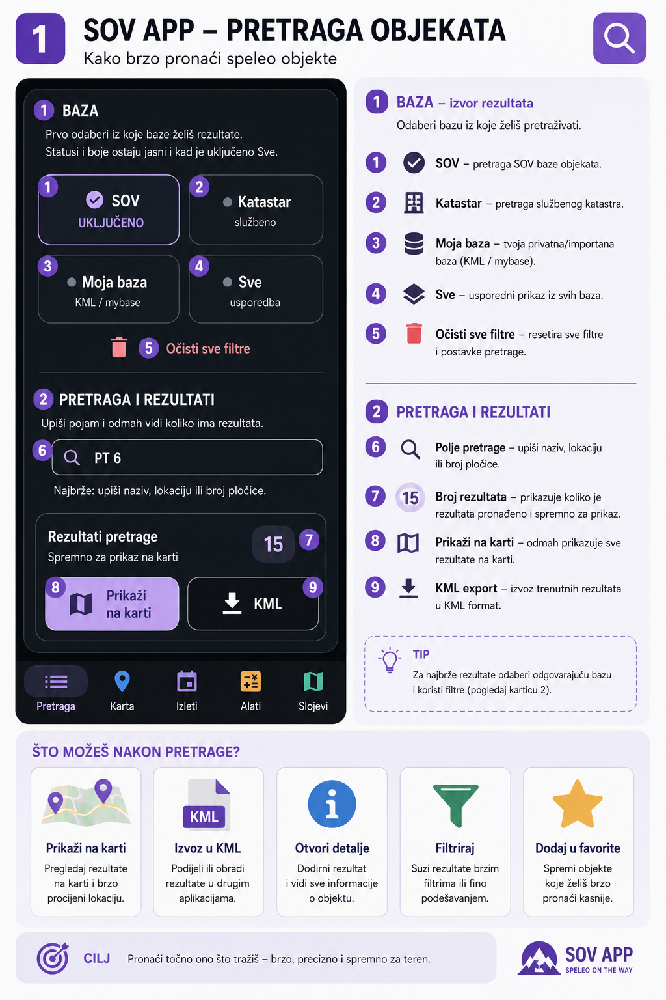

Pretraga služi za brzo pronalaženje objekata prema nazivu, lokaciji ili broju pločice.

Izvori pretrage:

- **SOV** — SOV baza objekata.
- **Moja baza** — tvoje uvezene KML/CSV točke.
- **Sve** — prikaz iz svih dostupnih lokalnih izvora.

Nakon pretrage možeš:

- prikazati rezultate na karti,
- otvoriti detalje objekta,
- izvesti trenutne rezultate u KML,
- dodatno suziti rezultate filterima.

---

## 4. Filteri i brzo filtriranje

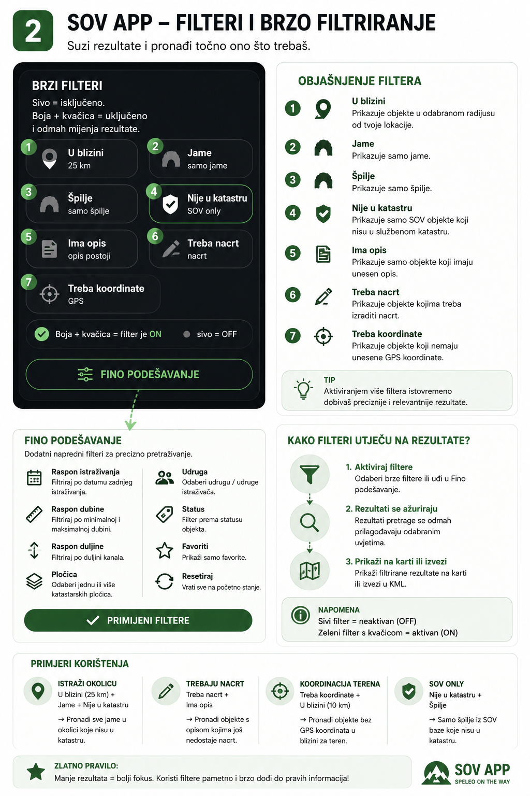

Filteri služe da brzo smanjiš broj rezultata i dobiješ samo ono što ti treba.

Brzi filteri:

- **U blizini** — objekti u odabranom radijusu.
- **Jame** — prikazuje samo jame.
- **Špilje** — prikazuje samo špilje.
- **Ima opis** — samo objekti koji imaju opis.
- **Treba nacrt** — objekti kojima treba ili nedostaje nacrt.
- **Treba koordinate** — objekti kojima nedostaju GPS koordinate.

Pravilo: **sivo = OFF**, **boja + kvačica = ON**.

---

## 5. Detalji objekta

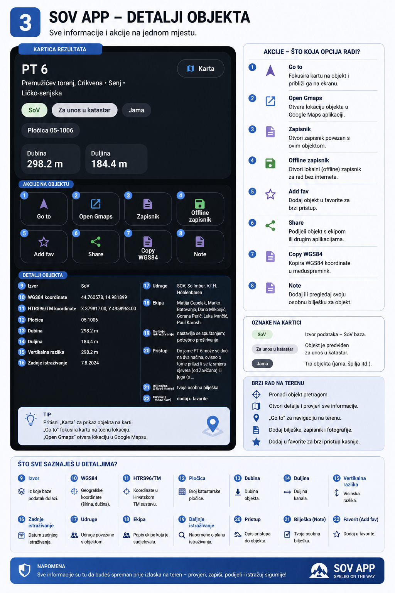

Detalji objekta prikazuju sve bitne informacije i akcije za teren.

Glavne akcije:

- **Go to** — fokusira objekt na karti.
- **Open Gmaps** — otvara lokaciju u Google Mapsu.
- **Zapisnik** — otvara zapisnik objekta.
- **Offline zapisnik** — lokalni zapisnik za rad bez interneta.
- **Add fav** — dodaje objekt u favorite.
- **Share** — dijeli objekt s ekipom ili drugim aplikacijama.
- **Copy WGS84** — kopira WGS84 koordinate.
- **Note** — dodaje osobnu/terensku bilješku.

Podaci u detalju mogu uključivati izvor, WGS84, HTRS96/TM, pločicu, dubinu, duljinu, vertikalnu razliku, zadnje istraživanje, udruge, ekipu, daljnje istraživanje i pristup.

---

## 6. Nacrti i TopoDroid

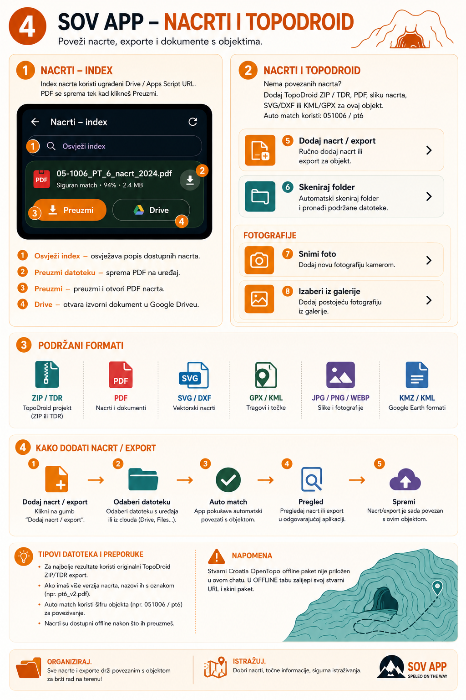

Sekcija za nacrte povezuje objekt s PDF nacrtima, Drive indexom, TopoDroid exportima i drugim dokumentima.

Mogućnosti:

- **Osvježi index** — povlači najnoviji popis nacrta iz ugrađenog Drive / Apps Script izvora.
- **Preuzmi** — sprema PDF nacrta na uređaj.
- **Drive** — otvara izvorni dokument u Driveu.
- **Dodaj nacrt / export** — ručno dodaje lokalni nacrt ili TopoDroid export.
- **Skeniraj folder** — pokušava automatski pronaći nacrte povezane s objektom.

Podržani formati za nacrte i exporte:

- ZIP / TDR,
- PDF,
- JPG / PNG / WEBP,
- SVG / DXF,
- KML / KMZ,
- GPX.

TopoDroid centerline na karti je orijentacijski prikaz: sidri se na koordinate ulaza i služi za smjer pružanja objekta, ne za službenu geodetsku preciznost.

---

## 7. Karte i slojevi

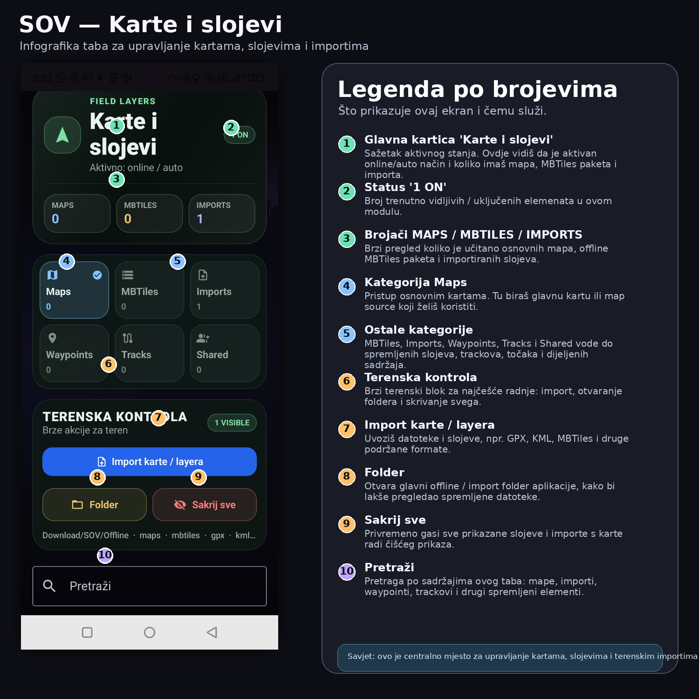

Ovo je centralno mjesto za karte, slojeve, offline pakete i terenske importe.

Kategorije:

- **Maps** — osnovne online/WMS karte.
- **MBTiles** — offline paketi karata.
- **Imports** — uvezeni slojevi i datoteke.
- **Waypoints** — spremljene korisničke točke.
- **Tracks** — snimljeni trackovi i rute.
- **Shared** — zajednički sadržaji koje je podijelila ekipa ili koji su podijeljeni s tobom.

U Maps / Layers možeš dodavati:

- hillshade slojeve,
- TK / Geo overlaye,
- vlastite WMS izvore,
- GPX / KML / MBTiles / CSV importe,
- zajedničke slojeve i točke.

---

## 8. Dodavanje waypointa

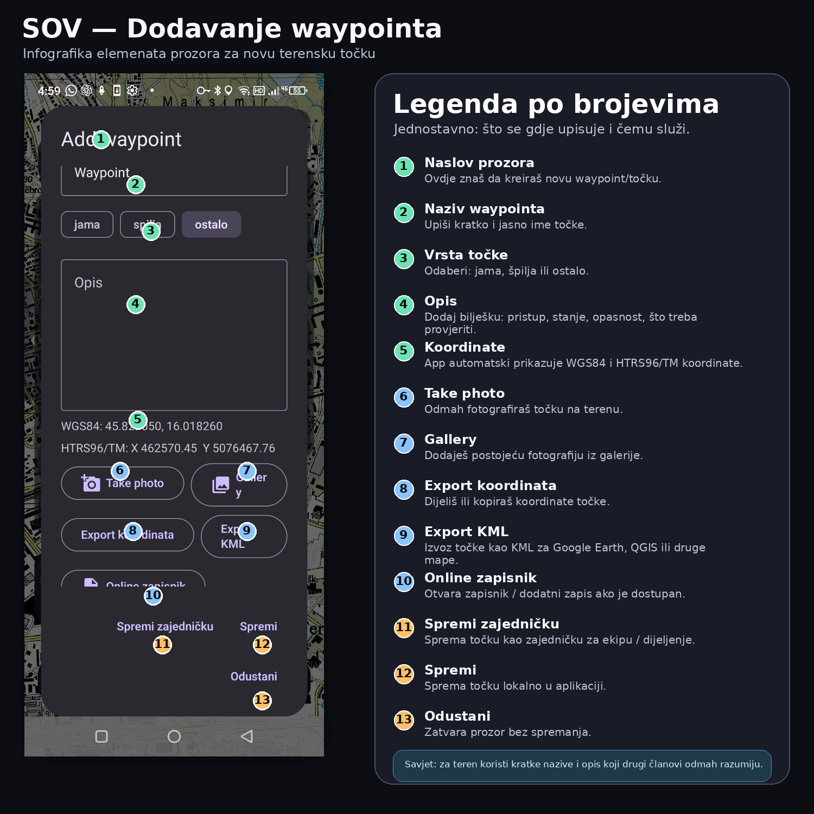

Waypoint je ručno dodana terenska točka.

Možeš upisati:

- naziv,
- tip: jama, špilja ili ostalo,
- opis,
- fotografiju,
- koordinate se automatski prikazuju u WGS84 i HTRS96/TM.

Waypoint možeš:

- spremiti lokalno,
- spremiti kao zajedničku točku,
- izvesti kao KML,
- podijeliti s ekipom.

---

## 9. Izleti / terenski paketi

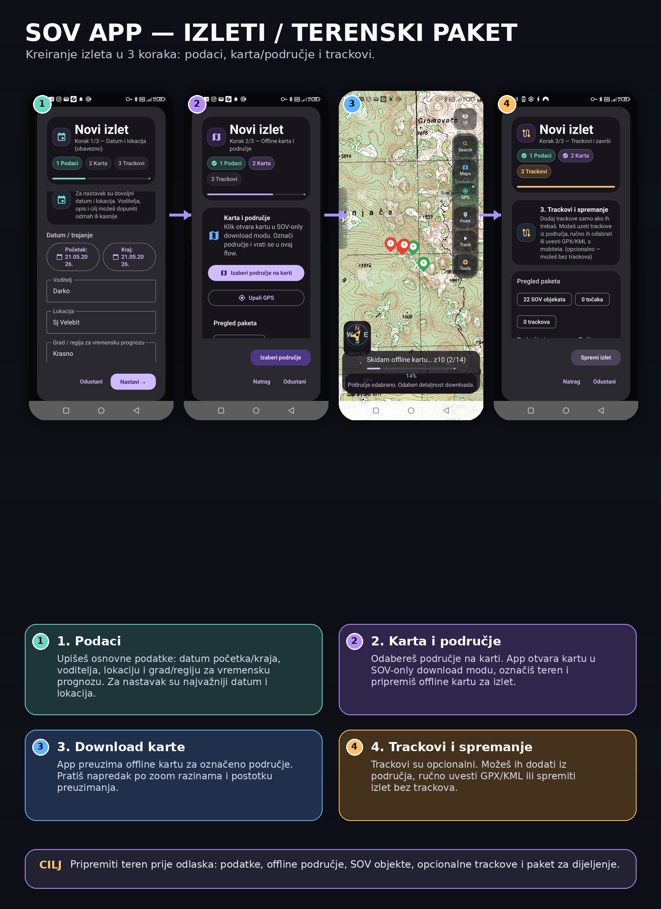

Izlet je terenski paket koji sadrži lokaciju, offline područje, SOV objekte i opcionalne trackove.

Kreiranje ide u 3 koraka:

1. **Podaci** — datum, trajanje, voditelj, lokacija i grad/regija za vremensku prognozu.
2. **Karta** — odabir područja na karti i priprema offline karte.
3. **Trackovi** — opcionalno dodavanje ili uvoz GPX/KML trackova.

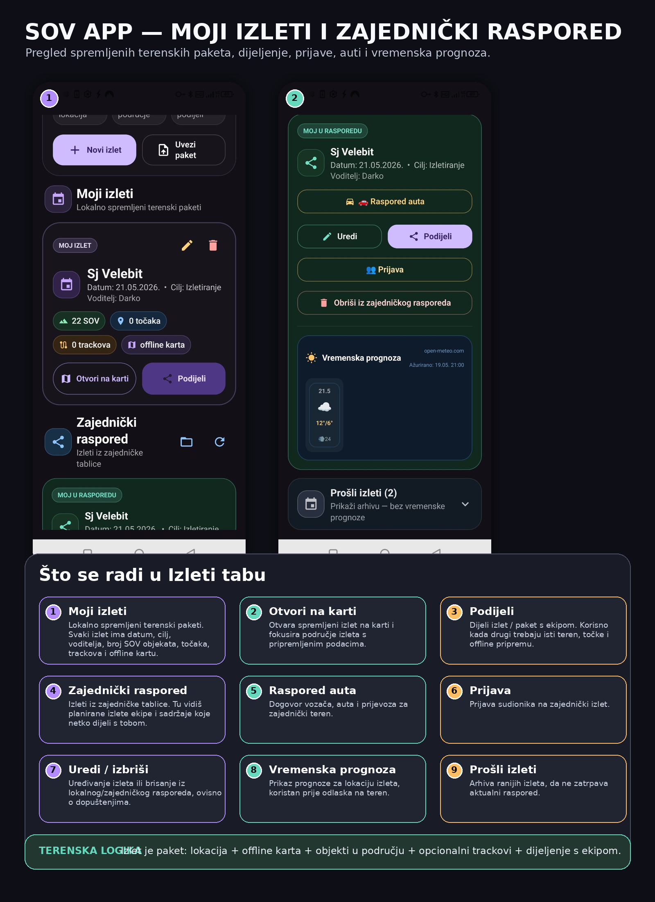

U Izleti tabu vidiš:

- **Moji izleti** — lokalno spremljeni terenski paketi.
- **Otvori na karti** — otvara pripremljeno područje.
- **Podijeli** — dijeli paket s ekipom.
- **Zajednički raspored** — izleti iz zajedničke tablice.
- **Raspored auta** — dogovor prijevoza.
- **Prijava** — prijava sudionika.
- **Vremenska prognoza** — prognoza za lokaciju izleta.
- **Prošli izleti** — arhiva ranijih izleta.

---

## 10. Postavke

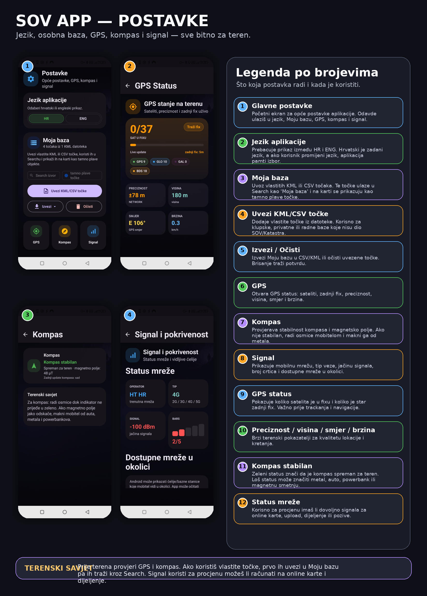

Postavke služe za jezik, osobnu bazu, GPS, kompas i signal.

- **Jezik aplikacije** — HR / ENG. Hrvatski je default, izbor se pamti.
- **Moja baza** — uvoz vlastitih KML/CSV točaka i izvoz u CSV/KML.
- **GPS** — sateliti, zadnji fix, preciznost, visina, smjer i brzina.
- **Kompas** — stabilnost kompasa i magnetsko polje.
- **Signal** — mobilna mreža, tip veze, jačina signala i dostupne mreže.

---

## 11. Offline rad i battery optimization

Za pouzdan teren:

- prije odlaska skini offline područje,
- provjeri GPS preciznost,
- uključi battery optimization exemption kada app to zatraži,
- za tracking koristi Start prije ulaska u zonu bez signala,
- nakon terena spremi ili exportaj GPX/KML.

Aplikacija ima GPS spike filter koji odbacuje nemoguće skokove lokacije, kako track ne bi dobio lažne kilometre.

---

## 12. Import / export

Podržani formati kroz app:

- **KML / KMZ** — točke, linije i slojevi.
- **GPX** — trackovi, rute i točke.
- **CSV** — tablične koordinate za Moju bazu.
- **MBTiles** — offline karte.
- **WMS URL** — vlastiti online map source.
- **PDF / slike / SVG / DXF / ZIP / TDR** — nacrti i TopoDroid materijali.

---

## 13. Dokumentacija u paketu

- Vizualni DOCX manual: `docs/manual/SOV_APP_v1.1_README_MANUAL_visual.docx`
- Slike za manual: `docs/manual/images/`
- Release notes: `docs/RELEASE_NOTES_1.1_PUBLIC.md`
- Changelog: `docs/CHANGELOG.md`
- Build history: `docs/BUILD_HISTORY.md`

